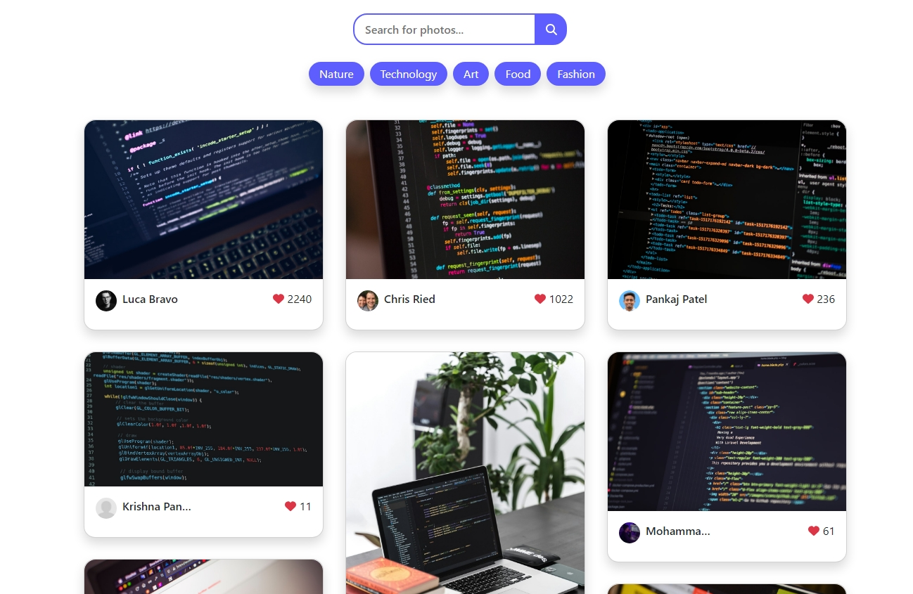
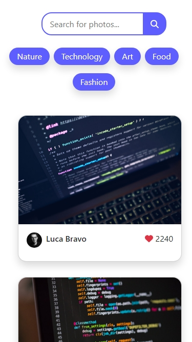

# Photo Gallery App in React JS

## Overview

This project is part of the Codevixens Frontend Development Challenge (Day 9). A simple photo gallery application built using React. It demonstrates how to integrate with an external API (Unsplash), manage state, and create a user interface to display fetched data.

## Features

- **API Integration**: Uses the Unsplash API to fetch images.
- **State Management**: Uses React's `useState` hook to manage the fetched photos, loading state, and potential errors.
- **UI Components**: A `Photo` component to display the photo, and the `PhotoGallery` component that renders the array of fetched photoss in a grid layout.
- **Error Handling**: Handles errors during API calls and provides appropriate feedback to the user.
- **User Interface**: Provides a simple UI for displaying the photos, including the photographer's name.

## Installation

1. Clone the repository:

```bash
git clone https://github.com/gideonagyage/Photo-Gallery.git
```

2. Navigate to the project directory:

```bash
cd Photo-Gallery
```

3. Install dependencies:

```bash
npm install
```

## Usage

1. Start the development server:

```bash
npm start
```

2. Open your browser and navigate to

```bash
http://localhost:3000.
```

## How it Works

The `PhotoGallery` component is the main component that houses the `Photo` components. It handles the following:

1. **API Integration**: Fetches photos from the Unsplash API using fetch.
2. **State Management**: Manages the fetched photos, loading state, and potential errors using useState.
3. **UI Rendering**: Renders the photo grid and provides error messages if necessary.

## Screenshots

- Desktop View



- Mobile View



<br>

## Live Demo

Check out the live demo [here](https://photo-gallery-navy-five.vercel.app/).

## Key Concepts

1. **API Integration**: Interacting with external APIs to fetch data.
2. **State Management**: Managing the data and UI state of the React application.
3. **UI Components**: Creating reusable components to build the user interface.

## Contributing

Feel free to fork this repository and submit pull requests. Any contributions are welcome!

## License

This project is licensed under the MIT License.

## Acknowledgements

- [Unsplash](https://unsplash.com/) for providing the API and beautiful images.
- [Codevixens](https://codevixens.org/) for organizing the challenge.
- Chinaza Igboanugo, Lois Bassey, and Oyinkansola Shoroye for their contributions and guidance.

Feel free to customize it further to fit your needs! If you have any specific details you'd like to add or change, let me know.
